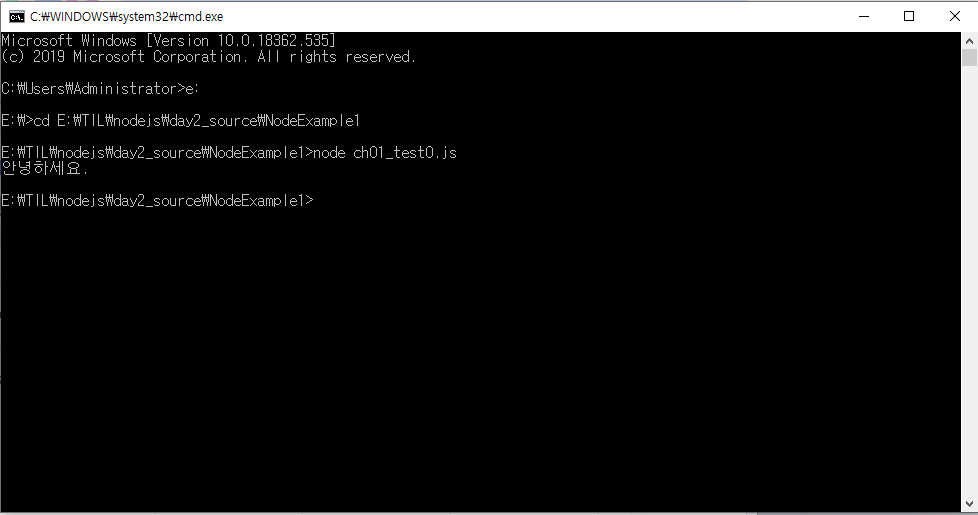
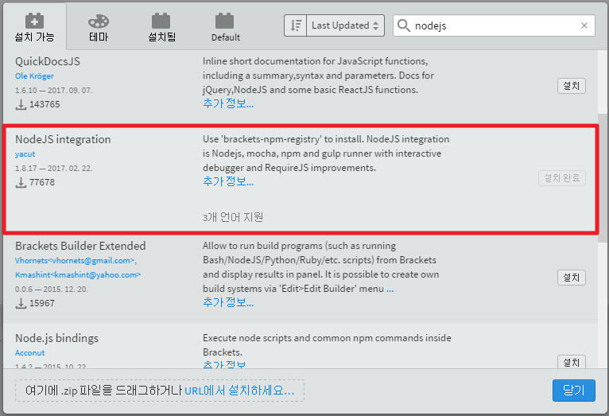
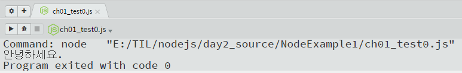
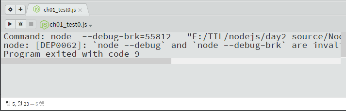

# node.js 첫 node 프로젝트 만들기

폴더 생성 - NodeExampl1

파일 생성 - ch01_test0.js

~~~javascript
console.log('안녕하세요.');
~~~

### 자바스크립트 파일 실행  

1. cmd 창으로 이동
2. 해당 js 파일이 있는 경로로 이동(cd 경로 명령어 사용)
3. node  ch01_test0.js 입력해서 실행

명령프롬프트 창으로 계속 실행하기에는 불편할 수 있으므로 브라켓의 **NodeJS intergration** 확장 프로그램을 사용

- 파일 → 확장 기능 관리자 → nodejs 검색 → NodeJS integration 설치
- 단축키 ctrl + shift + n으로 실행 가능

[실행 화면]

### 디버그 모드

- 벌레 모양의 버튼을 누르면 디버그 모드로 실행가능

~~~
Command: node  --debug-brk=55812   "E:/TIL/nodejs/day2_source/NodeExample1/ch01_test0.js" 
node: [DEP0062]: `node --debug` and `node --debug-brk` are invalid. Please use `node --inspect` and `node --inspect-brk` instead.
Program exited with code 9
~~~

debug mode가 제대로 실행되지 않음을 확인

(구글링을 해보았지만 명쾌한 해답을 찾지 못함)

